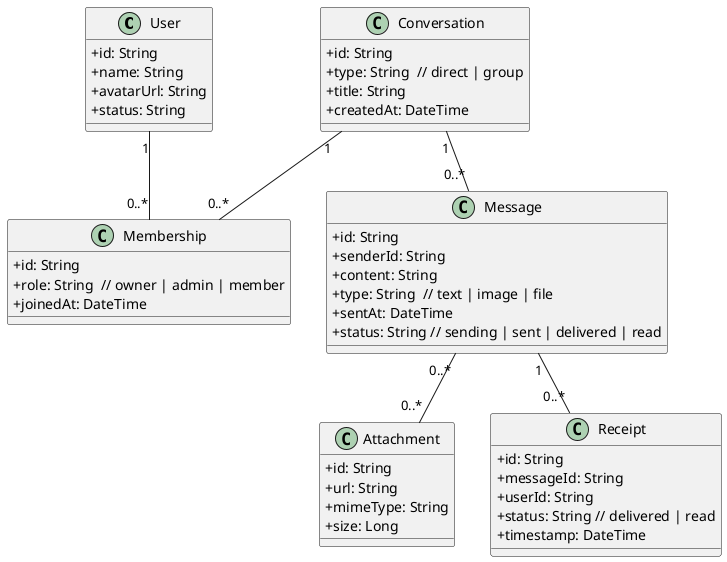

# 聊天软件类图（PlantUML）

以下为网页端聊天软件的核心领域模型类图，使用 PlantUML 表达。

说明：
- Conversation 是会话聚合根；Membership 体现用户与会话的多对多关系与角色。
- Message 归属 Conversation；Receipt 记录消息到达/已读状态。
- Attachment 与 Message 为多对多，便于一条消息携带多个附件。
