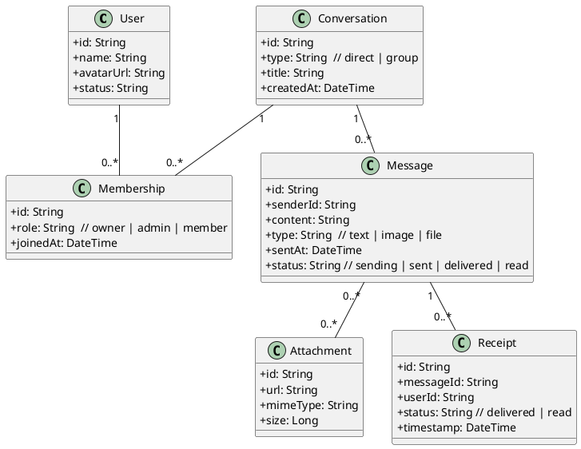

# 聊天軟體類圖（PlantUML）

```plantuml
@startuml
skinparam classAttributeIconSize 0

class User {
  +id: String
  +name: String
  +avatarUrl: String
  +status: String
}

class Conversation {
  +id: String
  +type: String  // direct | group
  +title: String
  +createdAt: DateTime
}

class Membership {
  +id: String
  +role: String  // owner | admin | member
  +joinedAt: DateTime
}

class Message {
  +id: String
  +senderId: String
  +content: String
  +type: String  // text | image | file
  +sentAt: DateTime
  +status: String // sending | sent | delivered | read
}

class Attachment {
  +id: String
  +url: String
  +mimeType: String
  +size: Long
}

class Receipt {
  +id: String
  +messageId: String
  +userId: String
  +status: String // delivered | read
  +timestamp: DateTime
}

User "1" -- "0..*" Membership
Conversation "1" -- "0..*" Membership
Conversation "1" -- "0..*" Message
Message "0..*" -- "0..*" Attachment
Message "1" -- "0..*" Receipt
@enduml
```

說明：
- Conversation 為聚合根。
- Membership 表示使用者與會話的多對多關係與角色。
- Receipt 記錄訊息送達/已讀狀態。
