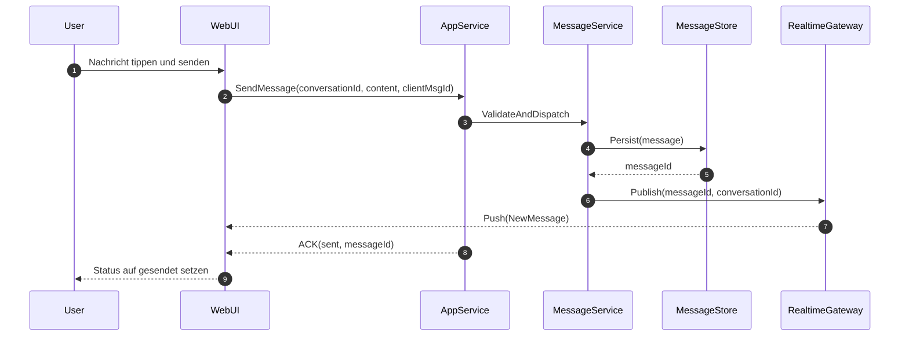

# Sequenzdiagramm (Mermaid)

```mermaid
sequenceDiagram
    autonumber
    participant U as User
    participant UI as WebUI
    participant API as AppService
    participant MSG as MessageService
    participant DB as MessageStore
    participant RT as RealtimeGateway

    U->>UI: Nachricht tippen und senden
    UI->>API: SendMessage(conversationId, content, clientMsgId)
    API->>MSG: ValidateAndDispatch
    MSG->>DB: Persist(message)
    DB-->>MSG: messageId
    MSG->>RT: Publish(messageId, conversationId)
    RT-->>UI: Push(NewMessage)
    API-->>UI: ACK(sent, messageId)
    UI-->>U: Status auf gesendet setzen
```

Hinweise:
- UI sendet, API validiert, MSG persistiert und publiziert, RT pusht.
- ACK aktualisiert lokalen Status; Push synchronisiert andere Clients.
