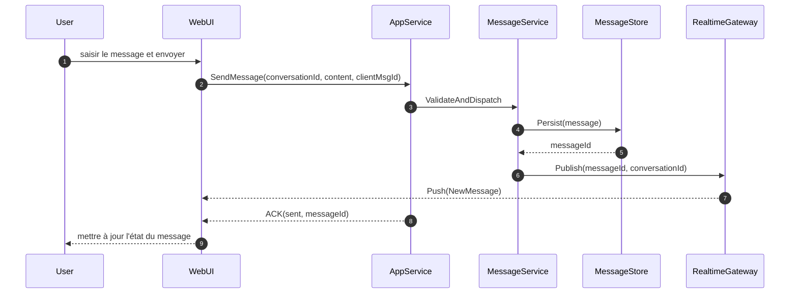

# Diagramme de séquence (Mermaid)

```mermaid
sequenceDiagram
    autonumber
    participant U as User
    participant UI as WebUI
    participant API as AppService
    participant MSG as MessageService
    participant DB as MessageStore
    participant RT as RealtimeGateway

    U->>UI: saisir le message et envoyer
    UI->>API: SendMessage(conversationId, content, clientMsgId)
    API->>MSG: ValidateAndDispatch
    MSG->>DB: Persist(message)
    DB-->>MSG: messageId
    MSG->>RT: Publish(messageId, conversationId)
    RT-->>UI: Push(NewMessage)
    API-->>UI: ACK(sent, messageId)
    UI-->>U: mettre à jour l'état du message
```

Notes :
- UI envoie, API valide, MSG persiste et publie, RT pousse vers les clients.
- ACK met à jour l'état local ; Push synchronise les autres clients.
