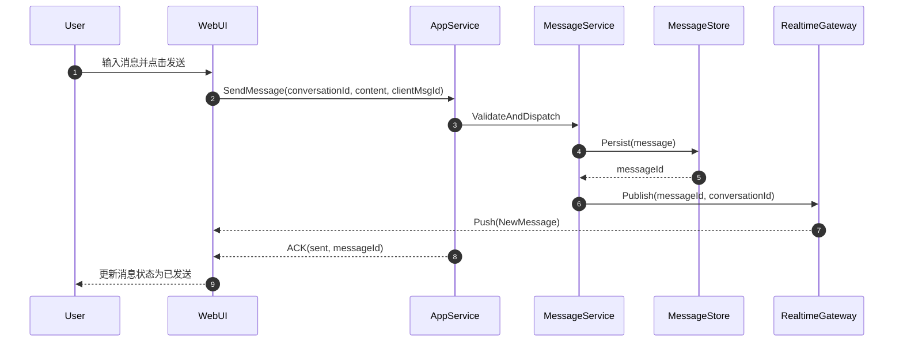

# 聊天软件时序图（Mermaid）

以下为网页端“发送消息”核心链路时序图：

```mermaid
sequenceDiagram
    autonumber
    participant U as User
    participant UI as WebUI
    participant API as AppService
    participant MSG as MessageService
    participant DB as MessageStore
    participant RT as RealtimeGateway

    U->>UI: 输入消息并点击发送
    UI->>API: SendMessage(conversationId, content, clientMsgId)
    API->>MSG: ValidateAndDispatch
    MSG->>DB: Persist(message)
    DB-->>MSG: messageId
    MSG->>RT: Publish(messageId, conversationId)
    RT-->>UI: Push(NewMessage)
    API-->>UI: ACK(sent, messageId)
    UI-->>U: 更新消息状态为已发送
```

说明：
- UI 先发起请求，API/MSG 完成校验与持久化，再通过实时通道推送。
- ACK 用于更新消息状态；Push 用于其他在线终端同步。
