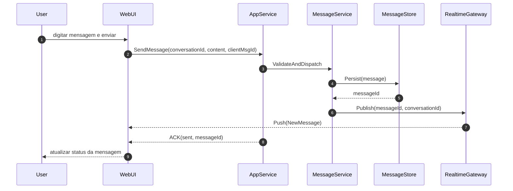

# Diagrama de sequência (Mermaid)

```mermaid
sequenceDiagram
    autonumber
    participant U as User
    participant UI as WebUI
    participant API as AppService
    participant MSG as MessageService
    participant DB as MessageStore
    participant RT as RealtimeGateway

    U->>UI: digitar mensagem e enviar
    UI->>API: SendMessage(conversationId, content, clientMsgId)
    API->>MSG: ValidateAndDispatch
    MSG->>DB: Persist(message)
    DB-->>MSG: messageId
    MSG->>RT: Publish(messageId, conversationId)
    RT-->>UI: Push(NewMessage)
    API-->>UI: ACK(sent, messageId)
    UI-->>U: atualizar status da mensagem
```

Notas:
- UI envia, API valida, MSG persiste e publica, RT faz push.
- ACK atualiza status local; push sincroniza outros clientes.
