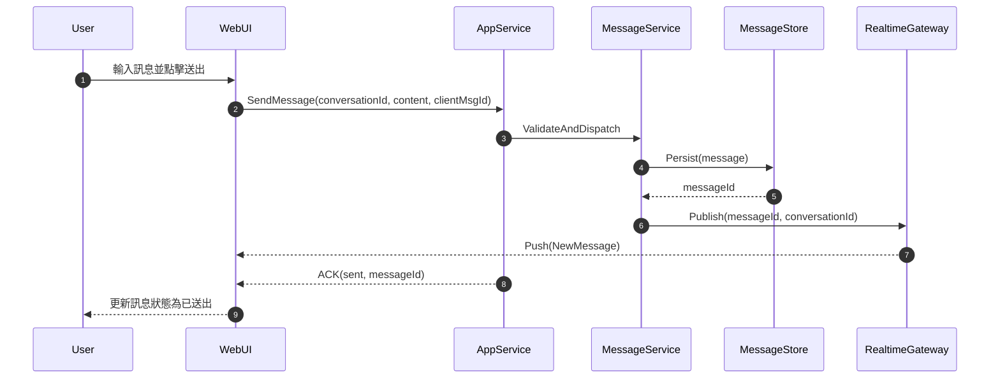

# 聊天軟體時序圖（Mermaid）

```mermaid
sequenceDiagram
    autonumber
    participant U as User
    participant UI as WebUI
    participant API as AppService
    participant MSG as MessageService
    participant DB as MessageStore
    participant RT as RealtimeGateway

    U->>UI: 輸入訊息並點擊送出
    UI->>API: SendMessage(conversationId, content, clientMsgId)
    API->>MSG: ValidateAndDispatch
    MSG->>DB: Persist(message)
    DB-->>MSG: messageId
    MSG->>RT: Publish(messageId, conversationId)
    RT-->>UI: Push(NewMessage)
    API-->>UI: ACK(sent, messageId)
    UI-->>U: 更新訊息狀態為已送出
```

說明：
- UI 發送請求，API/MSG 完成校驗與持久化，再由 RT 推送。
- ACK 用於更新本地狀態；Push 用於同步其他端。
